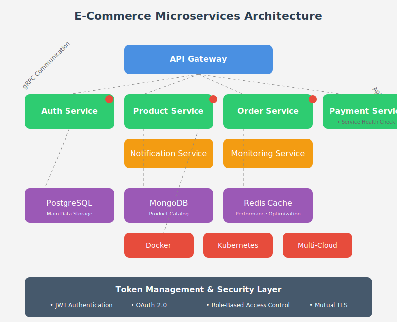

# E-Commerce Microservices

## Descripción General
Este repositorio contiene la implementación de una plataforma de comercio electrónico modular basada en una arquitectura de microservicios. Cada servicio independiente maneja una parte específica de la funcionalidad, promoviendo escalabilidad, mantenibilidad y despliegue independiente.

---

## Estructura del Proyecto
```
e-commerce-microservices/
├── apps/
│   ├── api-gateway/
│   ├── auth-service/
│   ├── product-service/
│   ├── order-service/
│   ├── payment-service/
│   ├── notification-service/
│   └── monitoring-service/
├── libs/
│   ├── common/
│   │   ├── src/
│   │   │   ├── interfaces/
│   │   │   ├── dtos/
│   │   │   └── decorators/
│   ├── database/
│   │   └── src/
│   │       ├── repositories/
│   │       └── migrations/
├── infrastructure/
│   ├── docker/
│   └── kubernetes/
├── docker-compose.yml
└── package.json
```

### Descripción de las carpetas principales:
- **`apps/`**: Contiene los microservicios individuales.
  - `api-gateway`: Puerta de enlace para gestionar autenticación, autorización y enrutamiento.
  - `auth-service`: Maneja la autenticación y autorización de usuarios.
  - `product-service`: Gestiona el catálogo de productos.
  - `order-service`: Procesa los pedidos de los clientes.
  - `payment-service`: Integra y procesa pagos.
  - `notification-service`: Envía notificaciones a los usuarios.
  - `monitoring-service`: Supervisa el estado de los microservicios.

- **`libs/`**: Contiene bibliotecas compartidas entre los servicios.
  - `common`: Incluye interfaces, DTOs y decoradores comunes.
  - `database`: Encapsula la lógica de acceso a bases de datos y migraciones.

- **`infrastructure/`**: Configuración de infraestructura y despliegue.
  - `docker`: Archivos Docker para containerización.
  - `kubernetes`: Manifiestos de Kubernetes para despliegues en la nube.

- **`docker-compose.yml`**: Configuración para despliegue local con Docker Compose.
- **`package.json`**: Definición de dependencias y scripts del proyecto.

---

## Reto y Contexto

### Reto:
Desarrollar una plataforma de comercio electrónico completa basada en una arquitectura de microservicios. El objetivo es que cada servicio sea modular, escalable y pueda ser desplegado de manera independiente. Este proyecto también será una herramienta educativa para aprender los principios fundamentales de microservicios y su implementación.

### Objetivos clave:
1. **Arquitectura modular**: Diseñar servicios independientes con responsabilidades claras.
2. **Seguridad**: Implementar autenticación y autorización robusta.
3. **Escalabilidad**: Permitir el despliegue y escalado independiente de cada servicio.
4. **Observabilidad**: Implementar monitoreo y logging centralizado.
5. **Transacciones distribuidas**: Gestionar la coordinación entre servicios utilizando patrones como SAGA.

---

## Historias de Usuario

### **[API Gateway]**
- Como cliente, quiero autenticarme utilizando JWT para acceder a los recursos protegidos.
- Como administrador, quiero configurar rutas para los microservicios para enrutar las solicitudes correctamente.

### **[Auth-Service]**
- Como usuario, quiero registrarme para crear mi cuenta en la plataforma.
- Como usuario, quiero iniciar sesión para acceder a mi perfil y realizar compras.

### **[Product-Service]**
- Como administrador, quiero agregar productos al catálogo con detalles como nombre, precio e imagen.
- Como cliente, quiero buscar productos por nombre o categoría para encontrar lo que necesito.

### **[Order-Service]**
- Como cliente, quiero realizar un pedido seleccionando productos del catálogo.
- Como cliente, quiero ver el historial de mis pedidos anteriores.

### **[Payment-Service]**
- Como cliente, quiero realizar el pago de mis pedidos utilizando mi tarjeta de crédito.
- Como administrador, quiero emitir reembolsos en caso de cancelación.

### **[Notification-Service]**
- Como cliente, quiero recibir notificaciones por correo electrónico sobre el estado de mis pedidos.
- Como administrador, quiero enviar notificaciones automáticas al procesar un pedido.

### **[Monitoring-Service]**
- Como DevOps, quiero recibir alertas cuando un microservicio deje de estar disponible.
- Como administrador, quiero consultar dashboards con el rendimiento de la plataforma.

---

## Tecnologías y Herramientas
- **Framework principal:** NestJS (Node.js)
- **Lenguaje:** TypeScript
- **Bases de datos:** PostgreSQL, MongoDB y Redis
- **Infraestructura:** Docker, Kubernetes
- **Monitoreo:** Prometheus, Grafana
- **Despliegue:** AWS, GCP, Azure (agnóstico de la nube)

---

## Instalación
### Requisitos previos
- Node.js v18+
- Docker y Docker Compose
- Kubernetes (opcional para despliegue avanzado)

### Pasos
1. Clona este repositorio:
   ```bash
   git clone https://github.com/poolcamacho/ecommerce-microservices.git
   cd ecommerce-microservices
   ```
2. Instala las dependencias:
   ```bash
   npm install
   ```
3. Inicia los servicios localmente con Docker Compose:
   ```bash
   docker-compose up
   ```
4. Accede al API Gateway en `http://localhost:3000`.

---

## Contribuciones
Se aceptan contribuciones para mejorar este proyecto. Por favor, sigue los pasos en `CONTRIBUTING.md` para más detalles.

---

## Licencia
Este proyecto está bajo la Licencia MIT. Consulta el archivo `LICENSE` para más información.
